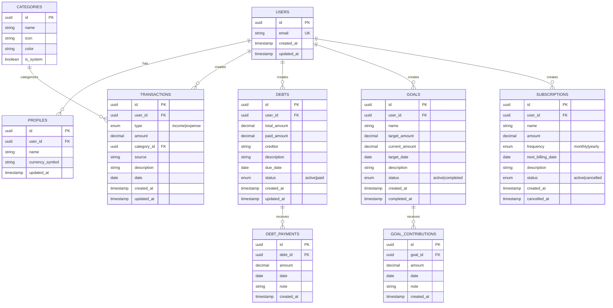

# Architecture Specifications — Finora

> Arquitectura técnica del MVP

*Version: 1.0 | MVP | Fecha: Enero 2025*

---

## 1. System Architecture

### 1.1 C4 Level 1 — System Context


### 1.2 C4 Level 2 — Container Diagram


### 1.3 Component Diagram — Frontend


### 1.4 Component Diagram — Backend


---

## 2. Database Design

### 2.1 Entity-Relationship Diagram



### 2.2 Notas sobre Database Design

> **IMPORTANTE**: Este diagrama es conceptual. El schema real de la base de datos se obtiene en tiempo real usando el **Supabase MCP**.
>
> No generar SQL schemas estáticos. Usar Supabase Dashboard o MCP para crear y modificar tablas.

### 2.3 Índices Recomendados

| Tabla | Índice | Columnas | Justificación |
|-------|--------|----------|---------------|
| transactions | idx_tx_user_date | (user_id, date DESC) | Listados por usuario y fecha |
| transactions | idx_tx_user_type | (user_id, type) | Filtro por tipo |
| transactions | idx_tx_category | (category_id) | Filtro por categoría |
| debts | idx_debts_user_status | (user_id, status) | Listado de deudas activas |
| debts | idx_debts_due | (due_date) | Ordenar por vencimiento |
| goals | idx_goals_user_status | (user_id, status) | Listado de metas activas |
| subscriptions | idx_subs_user_status | (user_id, status) | Listado de suscripciones activas |
| subscriptions | idx_subs_billing | (next_billing_date) | Próximos cobros |

### 2.4 Row Level Security (RLS) Policies

```sql
-- Ejemplo de RLS policy para transactions
-- (Referencia, usar Supabase Dashboard para implementar)

-- Policy: Users can only see their own transactions
CREATE POLICY "Users can view own transactions"
ON transactions FOR SELECT
USING (auth.uid() = user_id);

-- Policy: Users can only insert their own transactions
CREATE POLICY "Users can insert own transactions"
ON transactions FOR INSERT
WITH CHECK (auth.uid() = user_id);

-- Policy: Users can only update their own transactions
CREATE POLICY "Users can update own transactions"
ON transactions FOR UPDATE
USING (auth.uid() = user_id);

-- Policy: Users can only delete their own transactions
CREATE POLICY "Users can delete own transactions"
ON transactions FOR DELETE
USING (auth.uid() = user_id);
```

---

## 3. Tech Stack Justification

### 3.1 Frontend: Next.js 15 (App Router)

| Aspecto | Decisión |
|---------|----------|
| **Por qué elegido** | |
| ✅ | React Server Components para mejor performance inicial |
| ✅ | File-based routing simplifica estructura |
| ✅ | Full-stack framework (API routes integrados) |
| ✅ | Streaming y Suspense built-in |
| ✅ | Excelente DX y ecosistema maduro |
| **Trade-offs** | |
| ⚠️ | App Router relativamente nuevo (menos recursos legacy) |
| ⚠️ | Curva de aprendizaje vs Pages Router |

### 3.2 UI: TailwindCSS + Shadcn/ui

| Aspecto | Decisión |
|---------|----------|
| **Por qué elegido** | |
| ✅ | Utility-first CSS = desarrollo rápido |
| ✅ | Shadcn/ui = componentes accesibles y personalizables |
| ✅ | No vendor lock-in (código en tu repo) |
| ✅ | Consistencia visual automática |
| **Trade-offs** | |
| ⚠️ | HTML verboso con muchas clases |
| ⚠️ | Requiere conocer el sistema de Tailwind |

### 3.3 State Management: TanStack Query + Zustand

| Aspecto | Decisión |
|---------|----------|
| **Por qué elegido** | |
| ✅ | TanStack Query: caching inteligente de server state |
| ✅ | Zustand: UI state simple sin boilerplate |
| ✅ | Separación clara server vs client state |
| ✅ | Optimistic updates fáciles |
| **Trade-offs** | |
| ⚠️ | Dos librerías en vez de una (ej: Redux) |
| ⚠️ | Puede ser overkill para apps muy simples |

### 3.4 Validation: Zod

| Aspecto | Decisión |
|---------|----------|
| **Por qué elegido** | |
| ✅ | TypeScript-first, inferencia de tipos automática |
| ✅ | Mismos schemas en frontend y backend |
| ✅ | Integración perfecta con React Hook Form |
| ✅ | Mensajes de error personalizables |
| **Trade-offs** | |
| ⚠️ | Bundle size adicional (~12KB) |

### 3.5 Backend: Supabase

| Aspecto | Decisión |
|---------|----------|
| **Por qué elegido** | |
| ✅ | PostgreSQL completo (no NoSQL limitado) |
| ✅ | Auth built-in con múltiples providers |
| ✅ | Row Level Security (RLS) = seguridad en DB layer |
| ✅ | Realtime subscriptions (futuro) |
| ✅ | Free tier generoso para MVP |
| **Trade-offs** | |
| ⚠️ | Vendor lock-in (mitigado: PostgreSQL estándar) |
| ⚠️ | Menos control que infraestructura propia |

### 3.6 Hosting: Vercel

| Aspecto | Decisión |
|---------|----------|
| **Por qué elegido** | |
| ✅ | Zero-config deploy para Next.js |
| ✅ | Edge network global |
| ✅ | Preview deployments automáticos |
| ✅ | Analytics y Web Vitals integrados |
| **Trade-offs** | |
| ⚠️ | Costos pueden escalar con tráfico |
| ⚠️ | Vendor lock-in en algunas features |

### 3.7 Testing

| Tool | Uso | Justificación |
|------|-----|---------------|
| **Vitest** | Unit + Integration | Rápido, compatible con Vite, API similar a Jest |
| **Playwright** | E2E | Cross-browser, buena DX, assertions poderosas |
| **Postman/Newman** | API Testing | Standard de industria, collections compartibles |
| **axe-core** | Accessibility | Integración con CI, detecta issues WCAG |

---

## 4. Data Flow

### 4.1 User Registration Flow


### 4.2 Create Transaction Flow


### 4.3 Dashboard Data Flow


---

## 5. Security Architecture

### 5.1 Authentication Flow


### 5.2 Authorization with RLS

```mermaid
flowchart LR
    subgraph Request["API Request"]
        Token["JWT Token"]
        Query["SELECT * FROM transactions"]
    end

    subgraph Supabase["Supabase"]
        Auth["Auth Middleware"]
        RLS["RLS Policy Check"]
        DB[(PostgreSQL)]
    end

    Token -->|1. Validate| Auth
    Auth -->|2. Extract user_id| RLS
    Query -->|3. Execute| RLS
    RLS -->|4. Add WHERE user_id = auth.uid()| DB
    DB -->|5. Return only user's data| RLS
```

### 5.3 Data Protection Layers


### 5.4 Security Checklist

| Área | Control | Implementación |
|------|---------|----------------|
| **Auth** | JWT validation | Supabase middleware |
| **Auth** | Token refresh | Automatic via Supabase |
| **Auth** | Session invalidation | Logout endpoint |
| **Authz** | Data isolation | RLS policies |
| **Input** | Validation | Zod schemas (client + server) |
| **Input** | SQL Injection | Parameterized queries (Supabase) |
| **Output** | XSS prevention | React auto-escaping |
| **Transport** | Encryption | HTTPS enforced |
| **Storage** | Encryption | Supabase managed (AES-256) |
| **Passwords** | Hashing | bcrypt via Supabase Auth |
| **Rate Limit** | Brute force | Login rate limiting |

---

## 6. Deployment Architecture

### 6.1 Infrastructure Diagram


### 6.2 CI/CD Pipeline


---

## 7. Monitoring & Observability

### 7.1 Monitoring Stack (MVP)

| Área | Tool | Métricas |
|------|------|----------|
| **Performance** | Vercel Analytics | LCP, FID, CLS, TTFB |
| **Errors** | Vercel Logs | API errors, build errors |
| **Database** | Supabase Dashboard | Query performance, connections |
| **Uptime** | Vercel Status | Service availability |

### 7.2 Future Monitoring (v2)

| Área | Tool | Propósito |
|------|------|-----------|
| **APM** | Sentry | Error tracking, performance |
| **Logs** | LogDNA/Datadog | Centralized logging |
| **Alerts** | PagerDuty | Incident management |
| **Analytics** | PostHog | Product analytics |

---

## 8. Appendix

### 8.1 Folder Structure

```
finora/
├── app/                      # Next.js App Router
│   ├── (auth)/              # Auth routes group
│   │   ├── login/
│   │   └── register/
│   ├── (dashboard)/         # Protected routes group
│   │   ├── dashboard/
│   │   ├── transactions/
│   │   ├── debts/
│   │   ├── goals/
│   │   └── subscriptions/
│   ├── api/                 # API Routes
│   │   ├── auth/
│   │   ├── transactions/
│   │   ├── debts/
│   │   ├── goals/
│   │   ├── subscriptions/
│   │   └── dashboard/
│   ├── layout.tsx
│   └── page.tsx
├── components/              # React components
│   ├── ui/                  # Shadcn/ui components
│   ├── forms/               # Form components
│   ├── charts/              # Chart components
│   └── layout/              # Layout components
├── lib/                     # Utilities
│   ├── supabase/           # Supabase client
│   ├── validations/        # Zod schemas
│   └── utils/              # Helper functions
├── hooks/                   # Custom React hooks
├── stores/                  # Zustand stores
├── types/                   # TypeScript types
├── styles/                  # Global styles
├── public/                  # Static assets
├── tests/                   # Test files
│   ├── unit/
│   ├── integration/
│   └── e2e/
└── .context/               # Documentation
    ├── PRD/
    └── SRS/
```

### 8.2 Environment Variables

```bash
# .env.local (never commit)

# Supabase
NEXT_PUBLIC_SUPABASE_URL=https://xxx.supabase.co
NEXT_PUBLIC_SUPABASE_ANON_KEY=eyJ...
SUPABASE_SERVICE_ROLE_KEY=eyJ...  # Server-only

# App
NEXT_PUBLIC_APP_URL=http://localhost:3000

# Feature Flags (future)
NEXT_PUBLIC_ENABLE_SUBSCRIPTIONS=true
```

---

*Documento generado para: `.context/SRS/architecture-specs.md`*
*Última actualización: Enero 2025*
